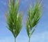

# Exercice 1 – Relation entre la teneur en amines et le stress salin

::: {.grid}

::: {.g-col-8}
L’étude suivante porte sur la réponse à un stress salin de différents bromes (graminées, voir photos). Nous disposions de trois espèces de bromes et pour chaque espèce la moitié des plantes ont été soumises à un stress salin et l’autre moitié des plantes “témoin” n’ont pas subi de stress. On a alors mesuré les concentrations de différentes amines sur chaque plante. Certaines données sont manquantes et donc le plan d’expériences n’est pas toujours équilibré. Toutes les données sont disponibles dans le fichier [amines.csv](https://agrocampusds.github.io/demarche_statistique/amines.csv).
:::

::: {.g-col-4}

 

{width=50%}
:::

:::

On voudra répondre aux questions suivantes :

* Le traitement a-t-il un effet significatif sur la concentration en amines ?
* La concentration en amines diffèrent-elles d’une espèce à l’autre ?
* Y a-t-il des différences significatives dans la réponse au stress d’une espèce à l’autre ?

1. Quel modèle utiliser ? Et à quoi correspond chaque effet que vous mettez dans votre modèle ?
2. Visualiser les données (les effets des facteurs et de l’interaction sur la concentration en amines).
3. Construire le modèle et donner le R² du modèle complet et du modèle sélectionné. Commenter.
4. Calculer la variabilité de la variable réponse puis calculer la somme des carrés expliqués par le modèle. Comparer la somme des carrés du modèle avec la somme des carrés de tous les effets présents dans le modèle.
5. Répondre aux 3 questions.

# Exercice 2 – La paléoclimatologie : les pollens témoins de l’évolution du climat

On s’intéresse ici à des données de paléoclimatologie, i.e. la science qui étudie les climats passés et leurs variations. Cela permet de mieux comprendre les évolutions du climat actuelles et à quel point elles sont liées à l’homme. Le jeu de données (fourni par Joël Guiot) correspond à 700 relevés (dans 700 endroits différents du globe) qui mesurent le pourcentage de pollens de 31 espèces d’arbres. Ces relevés ont été effectués récemment (lors de ce siècle) et nous disposons donc aussi des relevés de variables climatiques, et notamment la température moyenne annuelle.
On donne également pour chaque relevé le macrosystème (on parle aussi de biomes) du prélèvement. 9 macrosystèmes différents sont possibles : COCO (cool conifer forest), COMX (cool mixed forest), COST (cool steppes), HODE (hot desert), TEDE (temperate deciduous forest), TUND (tundra), WAMX (warm mixed broad-leaved forest), WAST (warm steppes), XERO (xerophytic scrubs). Les données sont disponibles dans le paleo_present.csv.

1. On cherche à modéliser la température annuelle en fonction des données disponibles. Proposer un modèle.
2. Construire ce modèle et commenter sa qualité.

On souhaite maintenant utiliser ce modèle pour prévoir la température moyenne annuelle des siècles précédents. On dispose pour cela des relevés d’une carotte glaciaire à partir de laquelle, siècle par siècle, on peut obtenir le pourcentage de chacun des 31 pollens. Ces échantillons remontent à 128 siècles et sont notés BPxx pour Before Present xx siècles : BP15 il y a 15 siècles (ceci est approximatif, la datation avant le présent est donnée dans la colonne age). Pour ces données (disponibles dans le fichier `paleo_passe.csv`), on ne dispose ni du macroécosystème, ni bien entendu du climat. L’objectif est d’essayer de prédire le climat au cours des siècles passés à partir de la composition en les différents pollens.
Importer le jeu de données en utilisant `row.names=1` pour que la date corresponde au nom de l’échantillon.

Le modèle que vous avez construit précédemment est-il utile pour prédire la température moyenne annuelle des siècles 
passés ? Si non, comment feriez-vous ?
Prédire la température moyenne annuelle pour le siècle BP15 et BP100 (il faudra certainement attendre le prochain cours pour savoir faire cette prévision !)
