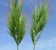

  
  
```{r setup-TD12, include=FALSE}
knitr::opts_chunk$set(echo = FALSE, cache= TRUE, eval = TRUE, message = FALSE, warning = FALSE, results = 'hide', fig.show = 'hide')
library(tidyverse)
library(kableExtra)
library(devtools) 
library(GGally)
library(ggcorrplot)
out_type <- knitr::opts_knit$get("rmarkdown.pandoc.to")
```
# {.tabset .tabset-fade .tabset-pills}

##  Objectifs de la séance  

* Construire un modèle
  + choisir les effets et interactions potentiels 
  + écrire le modèle
* Sélectionner un sous-modèle
* Interpréter la présence ou l'absence d'effet
 

### Relation entre la teneur en amines et le stress salin

L'étude suivante porte sur la réponse à un stress salin de différents bromes (graminées, voir photos). Nous disposions de trois
espèces de bromes et pour chaque espèce la moitié des plantes ont été soumises à un stress salin et l'autre moitié des plantes "témoin" n'ont pas subi de stress. 
On a alors mesuré les concentrations de différentes amines sur chaque plante. Certaines données sont manquantes et donc le plan d'expériences n'est pas toujours équilibré.



Toutes les données sont disponibles dans le [fichier](https://r-stat-sc-donnees.github.io/brome.csv).

On voudra répondre aux questions suivantes :

* Le traitement a-t-il un effet significatif sur la concentration en amines ?
* La concentration en amines diffèrent-elles d'une espèce à l'autre ?
* Y a-t-il des différences significatives dans la réponse au stress d'une espèce à l'autre ?

1. Quel modèle utiliser ? Et à quoi correspond chaque effet que vous mettez dans votre modèle ?
2. Visualiser les données (les effets des facteurs et de l'interaction sur la concentration en amines). 
3. Construire le modèle et donner le R² du modèle complet et du modèle sélectionné. Commenter.
4. Calcul la variabilité de la variable réponse puis calculer la somme des carrés expliqués par le modèle.
5. Comparer la somme des carrés expliqués par le modèle avec la somme des carrés de tous les effets présents dans le modèle.

Répondre aux 3 questions.


### La paléoclimatologie : utiliser les pollens comme témoins de l'évolution du climat

On s'intéresse ici à des données de paléoclimatologie, i.e. la science qui étudie les climats passés et leurs variations. Cela permet de mieux comprendre les évolutions du climat actuelles et à quel point elles sont liées à l'homme.
Le jeu de données (fourni par Joël Guiot) correspond à 700 relevés (dans 700 endroits différents du globe) qui mesurent le pourcentage de pollens de 31 espèces d'arbres. 
Ces relevés ont été effectués récemment (lors de ce siècle) et nous disposons donc aussi des relevés de variables climatiques, et notamment la température moyenne annuelle.

On donne également pour chaque relevé le macrosystème (on parle aussi de biomes) du prélèvement. 9 macrosystèmes différents sont possibles : COCO (cool conifer forest), COMX (cool mixed forest), COST (cool steppes), HODE (hot desert), TEDE (temperate deciduous forest), TUND (tundra), WAMX (warm mixed broad-leaved forest), WAST (warm steppes), XERO (xerophytic scrubs).

Les données sont diponibles dans le [fichier](https://r-stat-sc-donnees.github.io/paleo_present.csv). 

1. On cherche à voir s'il est possible de modéliser la température annuelle en fonction des données disponibles. Proposer un modèle.
2. Construire ce modèle et commenter la qualité du modèle (R²).

On souhaite maintenant utiliser ce modèle pour prévoir la température moyenne annuelle dans les siècles précédents. 
On dispose pour cela des relevés d'une carotte glaciaire. Sur cette carotte, on peut, siècle par siècle, obtenir le pourcentage de chacun des 31 pollens. Ces échantillons remontent à 128 siècles et sont notés BPxx pour Before Present xx siècles : BP15 il y a 15 siècles (ceci est approximatif, la datation avant le présent est donnée dans la colonne age). 
Pour ces données, on ne dispose pas du macroécosystème, ni bien entendu du climat. L'objectif est justement d'essayer de prédire le climat au cours des siècles passés à partir de la composition en les différents pollens.

Les données du passé, pour lesquelles on veut faire des prévisions, sont diponibles dans le [fichier](https://r-stat-sc-donnees.github.io/paleo_passe.csv). Pour importer ce jeu de données, on utilisera row.names=1 pour que la date correspond au nom de l'échantillon.

3. Le modèle que vous avez construit précédemment est-il utile pour prédire la température moyenne annuelle des siècles passé ? Si non, comment feriez-vous ?
4. Prédire la température moyenne annuelle pour le siècle BP15 et BP100 (il faudra certainement attendre le prochain cours pour savoir faire cette prévision !)

## Le vocabulaire de la séance

### Commandes R
- ggpairs
- LinearModel

### Environnement R


### Statistique 
- Régression linéaire multiple
- Sélection de sous-modèle 
