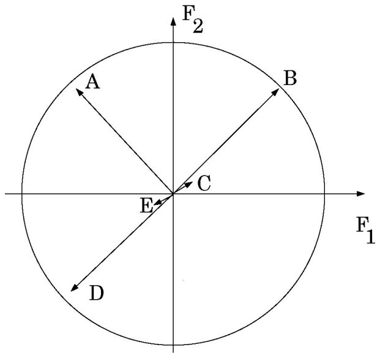

```{r setup-TD15, include=FALSE, }
knitr::opts_chunk$set(echo = FALSE, cache= TRUE, eval = TRUE, fig.show='hide', message = FALSE, warning = FALSE, results = 'hide' )
library(tidyverse)
library(kableExtra)
out_type <- knitr::opts_knit$get("rmarkdown.pandoc.to")
```


# {.tabset .tabset-fade .tabset-pills}

##  Objectifs de la séance  
- Comprendre la notion de projection des variables sur un plan.
- Utiliser Factoshiny pour effectuer une ACP.
- Interpréter un cercle des corrélations.
- Interpréter les premiers plans de l'ACP  à l'aide du cercle des corrélations et nuage des individus projetés.

## Exercices 

### Description du cercle des corrélations

La figure ci-dessous représente la projection de 5 variables sur le plan principal d'une ACP. 

- Que peut-on dire des corrélations entre les variables A-B, B-C, B-D et C-E ?

{width=50%}

- Quel est, approximativement, le pourcentage d'inertie associé au premier plan ?

### Analyse de performances en décathlon

Les épreuves du décathlon couronnent des athlètes complets. Toutefois, chaque athlète possède ses points forts et ses points faibles. C'est à cette variabilité que nous nous intéressons ici. Pour cela, on a regroupé les résultats de 4 décathlons : les Jeux Olympiques d'Athènes en 2004, ceux de Rio en 2016, les championnats d'Europe
2018 et le decastar de Talence en 2018. 

On dispose, pour chaque athlète, de ses performances à chacune des 10 épreuves, de son nombre de points (à chaque épreuve, un athlète gagne des points en fonction de sa performance) et de son classement final. 


Les épreuves se déroulent dans l'ordre suivant : 100m, longueur,poids, hauteur, 400m le premier jour et 110m haies, disque, perche, javelot, 1500m le deuxième jour. 

Nous avons conservé les 20 meilleurs athlètes pour chacun des décathlons dans le fichier suivant `decathlon.csv`.

Pour importer les données, utiliser les arguments `row.names=1` et `check.names=FALSE` . 

```{r, eval=TRUE, echo=FALSE, results='show'}
afondlaforme <- read.table("decathlon.csv", sep = ";", row.names = 1, header = TRUE, stringsAsFactors = TRUE)
glimpse(afondlaforme)
```


####  Une première impression sur les données 

- Décrire les données (variables ? individus ?) et préciser les objectifs d'une ACP effectuée sur ces données.

- Que pouvez-vous dire à partir des données centrées-réduites (utiliser la fonction `scale` ) ? Pourquoi est-ce important dans cet exemple de centrer et réduire les données

- Calculer la matrice des corrélations (avec la fonction `cor` et `round` pour arrondir les résultats).

```{r, eval=TRUE, echo=FALSE, results='show'}
afondlaforme %>% 
  select(1:10) %>% 
  cor() %>% 
  round(2)
```

#### Mettre en oeuvre une ACP
Utiliser le package  ensuite la fonction `PCAshiny` du package `Factoshiny` pour mettre en oeuvre une Analyse en Composantes Principales de ce tableau de données.

```{r, eval=FALSE, echo=FALSE, results='show'}
library(Factoshiny)
PCAshiny(afondlaforme)
```


- Quelles variables doit-on utiliser pour construire l'ACP ? Ces variables sont appelées variables actives. Mettre les autres variables en illustratif.

#### Interprétation à l'aide du premier plan de l'ACP 

- Quelle est l'inertie totale du nuage de points ?

- Quelle est l'inertie portée par le premier axe principal ? par le premier plan ?

- Commenter les pourcentages d'inertie expliquée par le premier axe de l'ACP, par le plan principal. Selon quel
point de vue est-il préférable que les 2 premiers axes n'expliquent pas trop l'inertie totale ?

- Quels sont les 5 athlètes les mieux représenter sur le premier plan principal ?

- Quels sont les athlètes qui contribuent le plus à la construction de la 1ère dimension de l'ACP ? Et à la
2ème ? Que signifie une contribution importante ?

- À partir du cercle des corrélations, que pouvez-vous dire concernant les corrélations suivantes :
  + 100 m haies - 400 m
  + 100 m - Longueur
  + Disque - Poids
  + Disque - Longueur
  + Perche - 1500 m

- Comparer les profils de MAYER et LELIEVRE. Puis ceux de Kaul et Duckworth. Que pouvez-vous dire sur la proximité entre Karpov et Clay ? Et celle entre Ziemek et Bernard ?

- Interpréter les facteurs principaux de l'ACP (à l'aide du graphe des individus et du graphe des variables
actives et illustratives). 


#### Au delà des deux premières dimensions 

- A partir des 4 variables les mieux projetées sur l'axe 3, comparer les profils des athlètes
qui sont opposés sur cet axe.

#### Pour finir 

- Dans quelles épreuves les vainqueurs des décathlons excellent-ils ? Certaines épreuves influent-elles peu la
performance (le nombre de points) au décathlon ?

- Comparer les performances réalisées aux quatre compétitions. Que pouvez-vous dire sur la performance moyenne lors de cette compétition ?


## Le vocabulaire de la séance

### Commandes R
- cor
- round
- Factoshiny
- PCAshiny

### Environnement R
- Factoshiny


### Statistique 
- ACP
- Inertie
- Axe et plan principal
