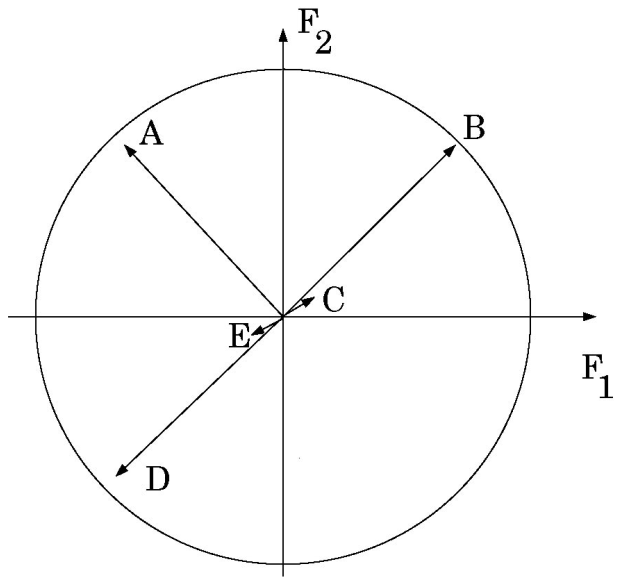

```{r setup-TD15, include=FALSE, }
knitr::opts_chunk$set(echo = FALSE, cache= TRUE, eval = TRUE, fig.show='hide', message = FALSE, warning = FALSE, results = 'hide' )
library(tidyverse)
library(kableExtra)
out_type <- knitr::opts_knit$get("rmarkdown.pandoc.to")
```


# {.tabset .tabset-fade .tabset-pills}

##  Objectifs de la séance  
- Explorer un jeu de données. 
- Visualiser les données pour formuler des hypothèses.
- Mettre en place une démarche pour tester ces hypthèses.

## Exercices 


Il n'y a pas une seule façon d'analyser ce jeu de données. A vous de trouver des analyses intéressantes.

L'exercice 2 est une rapide introduction au prochain cours sur les plans d'expériences, il est optionnel.

### la pollution de l'eau du Buëch
Le Buëch est une rivière des Alpes du Sud dont le bassin versant couvre 1480 $km^2$. 31 stations d'échantillonnage
ont été étudiées par F. Vespini (1985), P. Légier et A. Champeau (1987) qui ont publié la carte ci-dessous et le tableau qui forment la trame du problème.


En septembre, 10 variables physico-chimiques ont été mesurées sur l'eau de la rivière Buëch dans 31 stations
(indiquées ci-dessus : en rouge des stations sur la rivière principale, numérotées de l'amont vers l'aval, et en
bleu des stations sur des auents entre 2 stations sur la rivière principale : par exemple la station 4-1 est
entre la station 4 et la station 5). Les variables et leurs abréviations sont : pH, conductivité (cond, en μS/cm),
dureté calcique (mg/l CaCO3), dureté totale (dure mg/l CaCO3), alcalinité (mg/l HCO3−), chlorures (mg/l
Cl−), matières en suspension (mes , mg/l), matières organiques (mo , mg/l), nitrates (mg/l NO3− ), azote
ammoniacal (mg/l NH4− ).
Les données sont disponibles ici : https://husson.github.io/img/riviere.csv Analyser ces données pour
essayer de comprendre l'évolution de la qualité de l'eau.
Exercice 2 : Construction d'un plan complet 24−1
L'objectif de cet exercice est que vous tatonniez et essayez de construire le meilleur plan possible permettant
d'étudier 4 facteurs à 2 niveaux en 8 essais. Pour cela, récupérer le chier suivant sur votre ordinateur :
https://husson.github.io/img/planfra_4facteurs.xlsx
Choisissez ensuite les essais que vous voulez mettre dans votre plan en modiant les cellules B16 à E23. A chaque
modication, la qualité de votre plan est calculée grâce aux écarts-types des coecients du modèle d'analyse de
la variance (cellules M17 à M21). Vous pouvez comparer la qualité de votre plan avec la qualité du plan optimal
dont les écarts-types des coecients du modèle sont fournis cellules N17 à N21.
1
Indice : il est possible qu'un peu de réexion aide à trouver 
### Description du cercle des corrélations

La figure ci-dessous représente la projection de 5 variables sur le plan principal d'une ACP. 

- Que peut-on dire des corrélations entre les variables A-B, B-C, B-D et C-E ?

{width=50%}

- Quel est, approximativement, le pourcentage d'inertie associé au premier plan ?

### Analyse de performances en décathlon

Les épreuves du décathlon couronnent des athlètes complets. Toutefois, chaque athlète possède ses points forts et ses points faibles. C'est à cette variabilité que nous nous intéressons ici. Pour cela, on a regroupé les résultats de 4 décathlons : les Jeux Olympiques d'Athènes en 2004, ceux de Rio en 2016, les championnats d'Europe
2018 et le decastar de Talence en 2018. 

On dispose, pour chaque athlète, de ses performances à chacune des 10 épreuves, de son nombre de points (à chaque épreuve, un athlète gagne des points en fonction de sa performance) et de son classement final. 


Les épreuves se déroulent dans l'ordre suivant : 100m, longueur,poids, hauteur, 400m le premier jour et 110m haies, disque, perche, javelot, 1500m le deuxième jour. 

Nous avons conservé les 20 meilleurs athlètes pour chacun des décathlons dans le fichier suivant `decathlon.csv`.

Pour importer les données, utiliser les arguments `row.names=1` et `check.names=FALSE` . 

```{r, eval=TRUE, echo=FALSE, results='show'}
afondlaforme <- read.table("decathlon.csv", sep = ";", row.names = 1, header = TRUE, stringsAsFactors = TRUE)
glimpse(afondlaforme)
```


####  Une première impression sur les données 

- Décrire les données (variables ? individus ?) et préciser les objectifs d'une ACP effectuée sur ces données.

- Que pouvez-vous dire à partir des données centrées-réduites (utiliser la fonction `scale` ) ? Pourquoi est-ce important dans cet exemple de centrer et réduire les données

- Calculer la matrice des corrélations (avec la fonction `cor` et `round` pour arrondir les résultats).

```{r, eval=TRUE, echo=FALSE, results='show'}
afondlaforme %>% 
  select(1:10) %>% 
  cor() %>% 
  round(2)
```

#### Mettre en oeuvre une ACP
Utiliser le package  ensuite la fonction `PCAshiny` du package `Factoshiny` pour mettre en oeuvre une Analyse en Composantes Principales de ce tableau de données.

```{r, eval=FALSE, echo=FALSE, results='show'}
library(Factoshiny)
PCAshiny(afondlaforme)
```


- Quelles variables doit-on utiliser pour construire l'ACP ? Ces variables sont appelées variables actives. Mettre les autres variables en illustratif.

#### Interprétation à l'aide du premier plan de l'ACP 

- Quelle est l'inertie totale du nuage de points ?

- Quelle est l'inertie portée par le premier axe principal ? par le premier plan ?

- Commenter les pourcentages d'inertie expliquée par le premier axe de l'ACP, par le plan principal. Selon quel
point de vue est-il préférable que les 2 premiers axes n'expliquent pas trop l'inertie totale ?

- Quels sont les 5 athlètes les mieux représenter sur le premier plan principal ?

- Quels sont les athlètes qui contribuent le plus à la construction de la 1ère dimension de l'ACP ? Et à la
2ème ? Que signifie une contribution importante ?

- À partir du cercle des corrélations, que pouvez-vous dire concernant les corrélations suivantes :
  + 100 m haies - 400 m
  + 100 m - Longueur
  + Disque - Poids
  + Disque - Longueur
  + Perche - 1500 m

- Comparer les profils de MAYER et LELIEVRE. Puis ceux de Kaul et Duckworth. Que pouvez-vous dire sur la proximité entre Karpov et Clay ? Et celle entre Ziemek et Bernard ?

- Interpréter les facteurs principaux de l'ACP (à l'aide du graphe des individus et du graphe des variables
actives et illustratives). 


#### Au delà des deux premières dimensions 

- A partir des 4 variables les mieux projetées sur l'axe 3, comparer les profils des athlètes
qui sont opposés sur cet axe.

#### Pour finir 

- Dans quelles épreuves les vainqueurs des décathlons excellent-ils ? Certaines épreuves influent-elles peu la
performance (le nombre de points) au décathlon ?

- Comparer les performances réalisées aux quatre compétitions. Que pouvez-vous dire sur la performance moyenne lors de cette compétition ?


## Le vocabulaire de la séance

### Commandes R
- cor
- round
- Factoshiny
- PCAshiny

### Environnement R
- Factoshiny


### Statistique 
- ACP
- Inertie
- Axe et plan principal
