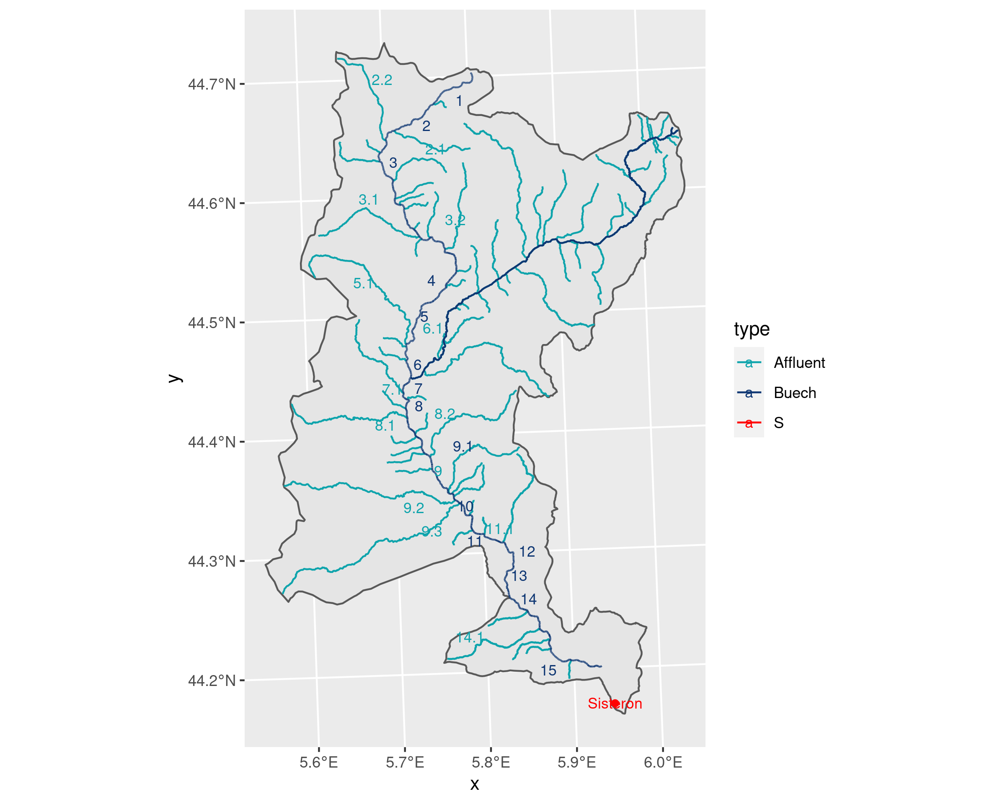

```{r setup-TD15, include=FALSE, }
knitr::opts_chunk$set(echo = FALSE, cache= TRUE, eval = TRUE, fig.show='hide', message = FALSE, warning = FALSE, results = 'hide' )
library(tidyverse)
library(kableExtra)
out_type <- knitr::opts_knit$get("rmarkdown.pandoc.to")
```


# {.tabset .tabset-fade .tabset-pills}

##  Objectifs de la séance  
- Utiliser l'ACP pour explorer un jeu de données

## Exercices 


Il n'y a pas une seule façon d'analyser ce jeu de données. A vous de trouver des analyses intéressantes.


### la pollution de l'eau du Buëch 
Le Buëch est une rivière des Alpes du Sud dont le bassin versant couvre 1480 $km^2$. 31 stations d'échantillonnage
ont été étudiées par F. Vespini (1985), P. Légier et A. Champeau (1987) qui ont publié la carte ci-dessous et le tableau qui forment la trame du problème.


```{r buech_map, echo=FALSE, fig.cap="Les sites mesurés sur le Buëch", out.width = '100%', eval = TRUE, fig.show='asis', results='asis'}

```


En septembre, 10 variables physico-chimiques ont été mesurées sur l'eau de la rivière Buëch dans 31 stations (avec un entier lorsqu'il s'agit d'une mesure sur le Buëch et une notation x.y pour les affluents qui rejoignent le Buëch sous la station x, l par exemple la station 4-1 est
entre la station 4 et la station 5). 

Les variables et leurs abréviations sont : 

-  pH, 
- conductivité (cond, en μS/cm), 
- dureté calcique (mg/l CaCO3), 
- dureté totale (dure mg/l CaCO3), 
- alcalinité (mg/l HCO3−), chlorures (mg/l Cl−), 
- matières en suspension (mes , mg/l), 
- matières organiques (mo , mg/l), 
- nitrates (mg/l NO3− ), 
- azote ammoniacal (mg/l NH4− ).


Les données sont disponibles [ici](buech.csv) 


Analyser ces données pour essayer de comprendre l'évolution de la qualité de l'eau.


## Le vocabulaire de la séance

### Commandes R
- Factoshiny


### Environnement R
- Factoshiny


### Statistique 
- ACP
- Inertie
- Axe et plan principal
