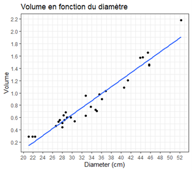

## Exercice 1 – Taille des mares et biodiversité des amphibiens

Un écologue s'intéresse aux mares agricoles. Pour chacune de 50 mares, il mesure la surface de la mare (en m²) et le nombre d'espèces d'amphibiens observées. Un premier graphique semble montrer que les grandes mares abritent davantage d'espèces.

1. Quelle est la question scientifique ?
2. Quelle est la variable explicative ? Quelle est la variable réponse ?
3. Pourquoi une ANOVA n'est-elle pas adaptée ici ? Quel type d'analyse paraît plus pertinent ?
4. Si le nuage de points montre une tendance croissante, que signifie cette observation ?
5. Peut-on conclure que l'augmentation de la surface cause directement l'augmentation du nombre d'espèces ?
6. Quels autres facteurs pourraient intervenir ?

## Exercice 2 – Estimation du volume d'un arbre

On mesure le volume (m3) et le diamètre (cm) à hauteur de buste (à 1m37) de 31 cerisiers tombés au sol. On cherche à savoir si on peut déterminer le volume d'un cerisier en fonction de son diamètre à hauteur de buste.

1. Préciser la nature de la variable réponse ainsi que la nature de la variable explicative.
2. Ecrire le modèle correspondant.
3. On ajuste le modèle en utilisant la fonction `LinearModel`. Remplacez les ??? par des valeurs que vous approximerez à partir de la figure ci-contre.
4. Donnez une interprétation compréhensible pour un public non-spécialiste de ces coefficients.
5. Que contiennent les différentes colonnes du tableau ? Qu'est-ce qui est testé ?
6. On souhaite estimer le volume d'un cerisier (sur pied cette fois-ci !). On mesure son diamètre de 54 cm à hauteur de buste. En s'appuyant sur le modèle, à quel volume s'attend-on pour cet arbre ?


::: {.grid}

::: {.g-col-7}

```
> LinearModel(Volume~Diamètre,data=arbre)

Call:
LinearModel(formula = Volume~Diamètre, data=arbre)

Residual standard error: 0.1203 on 29 degrees of freedom
Multiple R-squared:  0.9354 
F-statistic: 419.7 on 1 and 29 DF,  p-value: 8.563e-19 
AIC = -129.3    BIC = -126.5

Ftest
              SS df     MS F value    Pr(>F)
Diamètre  6.0774  1 6.0774  419.65 < 2.2e-16
Residuals 0.4200 29 0.0145                  

Ttest
              Estimate Std. Error t value  Pr(>|t|)
(Intercept)        ???      0.095 -10.980 7.591e-12
Diamètre           ???      0.003  20.485 < 2.2e-16
```

:::


::: {.g-col-5}

{width=150%}

:::

:::

