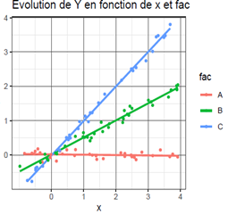

## Exercice 1 – Construction d’un modèle, choix des effets et interactions

1.	Quelles variables explicatives, quelles interactions utiliseriez-vous pour construire un modèle permettant de prédire (répondre à 2 questions au choix parmi les 4)

*	la taille d’un individu adulte ?
*	la taille d’un enfant entre 2 et 15 ans.
*	le nombre de lombrics dans un cube de terre de 10 cm de côté ?
*	le poids des poubelles à la cantine de l’IA ?

2.	Préciser quelles variables sont quantitatives (resp. qualitatives) puis écrire le modèle.

## Exercice 2 – Interpréter un modèle

::: {.grid}

::: {.g-col-7}

On étudie l’effet d'une variable qualitative fac à 3 modalités (A, B et C) et d'une variable quantitative x sur une variable réponse Y. On visualise les données avec le graphique ci-contre avant de construire le modèle : 

$$Y_{ij} = \mu + \alpha_i + (\beta + \gamma_i)x_{ij} + \varepsilon_{ij} $$
1.	Quel est le nom de ce modèle ?
2.	Donner une estimation de $\mu$ et une de $\beta$
3.	Donner une estimation des $\alpha_i$
4.	Donner une estimation des $\gamma_i$
5.	Selon vous, y a-t-il un effet significatif de x sur Y ? un effet de fac sur Y ? un effet de l'interaction entre fac et x sur Y ?

:::

::: {.g-col-5}

{width=150%}

:::

:::

## Exercice 3 – Stockage de carbone dans les sols agricoles

Une équipe de recherche souhaite comprendre pourquoi certaines parcelles stockent davantage de carbone que d'autres. Pour chaque parcelle, on mesure :

*	le stock de carbone du sol ; 
*	la quantité annuelle de biomasse restituée au sol ; 
*	le nombre d'années sous couvert végétal ; 
*	le travail du sol (labour ou semis direct) ; 
*	la teneur en argile. 

Après analyse, les chercheurs constatent que les parcelles en semis direct stockent davantage de carbone mais elles sont aussi souvent celles qui ont les couverts végétaux les plus développés. 

1.	Quelle est la variable réponse ? Quelles sont les variables explicatives ?
2.	Pourquoi est-il difficile d'attribuer directement l'augmentation du carbone au seul semis direct ?
3.	Quelles variables pourraient jouer un rôle de confusion ?
4.	Pourquoi un modèle prenant en compte plusieurs variables explicatives semble-t-il nécessaire ?
5.	Si l'effet du semis direct disparaît après prise en compte de la biomasse restituée, comment pourriez-vous interpréter ce résultat ?
6.	Si l'effet du semis direct reste important même après prise en compte des autres variables, qu'est-ce que cela suggère ?
